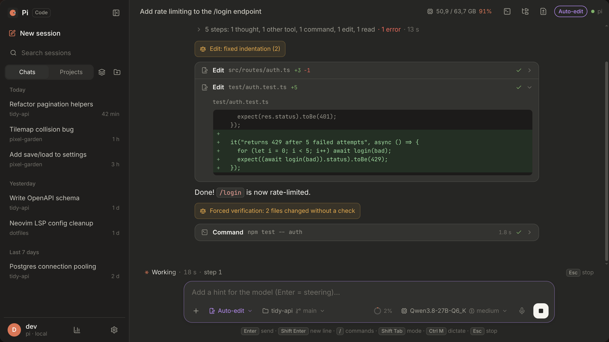
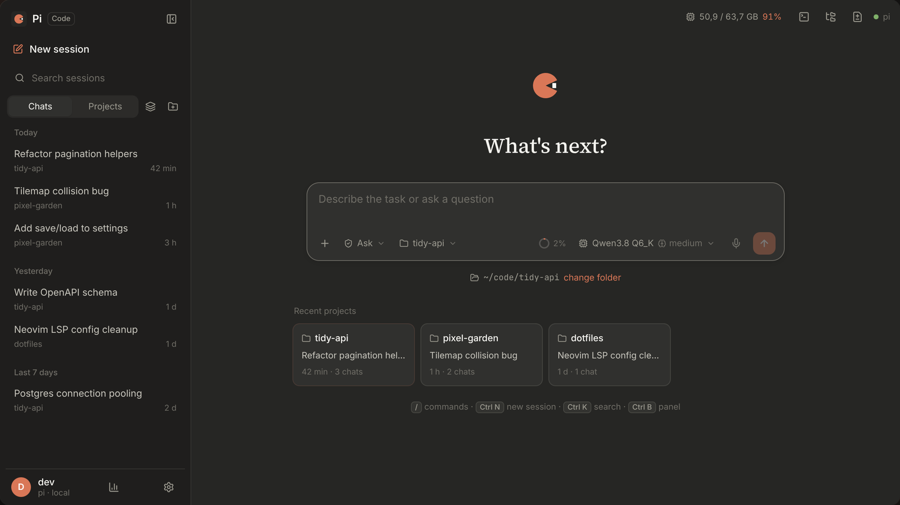
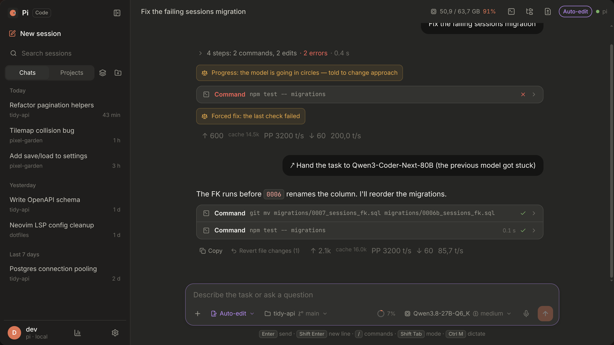
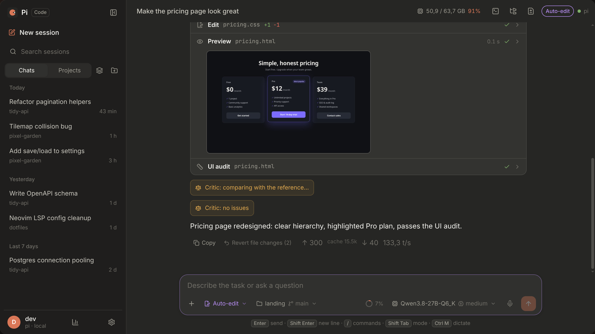

<p align="center"></p>

# Pi Code

A desktop app for [pi](https://www.npmjs.com/package/@earendil-works/pi-coding-agent), the coding agent,
built to feel like the Code tab of Claude Desktop, but aimed at **local models**
(llama.cpp / llama-server, vLLM, LM Studio, Ollama, or any OpenAI-compatible server)
as well as hosted providers.

> **Early alpha. Linux only.** It has been used daily on one machine (Arch-based, Wayland, NVIDIA).
> Expect rough edges. Windows and macOS are not supported yet.



## What it does

- **Live view of the agent:** streaming answers, thinking, and every tool call with its arguments and result.
  Edits show as a real diff. Long finished chains of steps fold into one row.
- **Permission modes:** ask before every action, or let read-only commands through automatically
  (a shell parser checks each command and its arguments). Risky actions always ask.
  "Always in this session" remembers command prefixes such as `pnpm test`.
- **Local-model stats** when llama-server runs on `localhost:8080`: tokens/s, prompt processing progress,
  GPU status, and a per-turn timeline showing where the time went.
- **Sessions and projects:** a sidebar of chats, recent projects on the welcome screen, a files panel
  (click to insert `@path`), and a changes panel with git status.
- **Handoff to a new session**, open the same session in a terminal with `pi`, and context usage at a glance.
- **Dictation** (optional) through any OpenAI-compatible `/audio/transcriptions` endpoint.
- **Add-ons** you can toggle: a working constitution, guards, review, and memory.
- UI in **English** and **Polish** (it follows the system locale).

## Screenshots

| | |
|---|---|
|  |  |
| Welcome screen: sessions, recent projects, your model | A model going in circles is told to change approach, then handed to a bigger one |
|  |  |
| Every step on screen; no "done" without a check | Pages and SVGs are rendered and looked at before the answer |

<sub>Screenshots come from a staged session (a scripted sidecar), rendered by the real UI.</sub>

## Requirements

- Linux x86_64 with WebKitGTK (standard on most desktops). The AppImage is built on Ubuntu 22.04,
  so it needs glibc 2.35 or newer.
- **Node.js: nothing to install for the AppImage from Releases**, it carries its own Node for the
  pi process. Pi Code looks for Node in this order: `$PI_CODE_NODE` (when set, the only one tried),
  the bundled one, then `node` on `PATH`. Each must be **22.19 or newer**. If none works, the window
  says which binaries it tried and what to change, instead of closing.
- A model: a server on your machine (llama.cpp, vLLM, LM Studio, Ollama) or a hosted provider.
  See [Connect a model](#connect-a-model).
- Optional: the `pi` CLI (for "open in terminal" and sign-ins that need a browser),
  `nvidia-smi` (GPU status), `pw-record` / `parecord` / `arecord` (dictation),
  ImageMagick 7 (`magick`), `rsvg-convert` and Graphviz (`dot`) for the agent's `look` tool
  (previews of images, SVG, diagrams and pages)

## Install

Download `Pi Code_x.y.z_amd64.AppImage` from [Releases](../../releases), then:

```bash
chmod +x "Pi Code_"*.AppImage
./"Pi Code_"*.AppImage
```

To run the pi process on a Node of your choice:

```bash
PI_CODE_NODE=/opt/node-22/bin/node ./"Pi Code_"*.AppImage
```

## Connect a model

The first start opens a short wizard; it can be skipped and done later in
**Settings → Model providers**. Until a model is picked, the message box says so and Enter
opens that page.

- **A server on your machine** (llama.cpp's `llama-server`, vLLM, LM Studio, Ollama, or anything
  OpenAI-compatible): **Own server** → a name and the URL, e.g. `http://localhost:8080/v1`
  (Ollama: `http://localhost:11434/v1`) → **Test connection** → tick the models → **Add server**.
  It is written to `~/.pi/agent/models.json`, the same file the `pi` CLI uses.
  With llama-server on `localhost:8080` Pi Code also shows speed, prompt progress and GPU state.
- **A hosted provider with an API key** (OpenRouter, Anthropic, OpenAI…): **API key**, pick the
  provider, paste the key. It goes to `~/.pi/agent/auth.json`.
- **Account sign-ins** (Claude Pro/Max, ChatGPT, GitHub Copilot) need a browser: run `pi` in a
  terminal and type `/login`. Pi Code picks them up the next time the list opens.

## Build from source

You need Node 22.19+, pnpm, and a Rust toolchain with the
[Tauri 2 prerequisites for Linux](https://tauri.app/start/prerequisites/).

```bash
pnpm install
pnpm test          # unit, component and e2e tests (the e2e test talks to your default model)
pnpm dev           # browser dev mode: vite + a WebSocket bridge to the sidecar
pnpm desktop       # debug build of the desktop window
pnpm appimage      # release AppImage → src-tauri/target/release/bundle/appimage/
```

`pnpm appimage` does not bundle Node: the result runs the pi process on the system `node`. The
release build adds one:

```bash
dev/fetch-node.sh  # official Node 22 build, checksum-verified, into vendor/node/
pnpm sidecar-rt
NO_STRIP=1 pnpm exec tauri build --config src-tauri/tauri.node.conf.json
```

`NO_STRIP=1` matters: stripping breaks the bundled WebKit and the AppImage stops with
"The WebKit binary … is missing".

### Releases

Pushing a tag `v*` that matches the version in `src-tauri/tauri.conf.json` runs
`.github/workflows/release.yml`: tests (without e2e), the AppImage on Ubuntu 22.04 with Node bundled,
and a **draft pre-release** with the AppImage attached. Publishing is done by hand on GitHub.

### How it is put together

```text
src/          React UI
src-tauri/    Rust: window, spawns the sidecar, pipes its events to the UI
sidecar/      Node + pi SDK: sessions, tools, permissions, stats (JSON lines over stdio)
shared/       protocol types, shell parser, i18n shared by both sides
```

## License

[GPL-3.0-or-later](LICENSE). You may use, share and modify Pi Code freely. If you distribute it,
modified or not, you must share the source under the same license.
